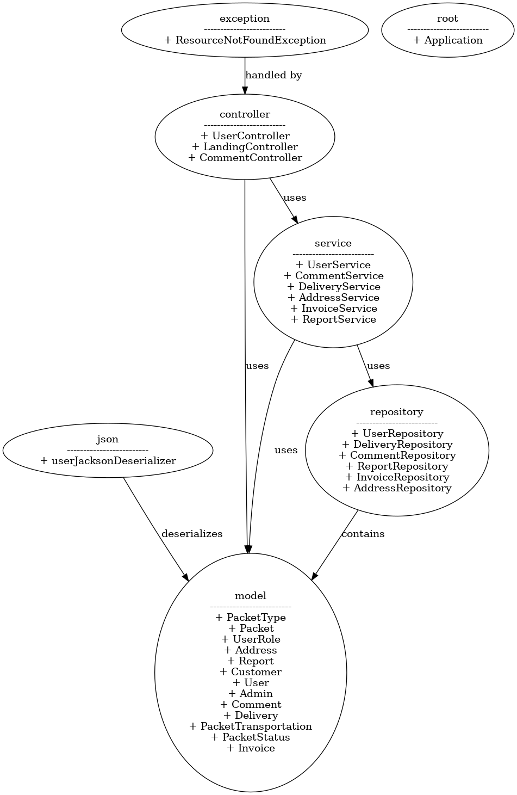
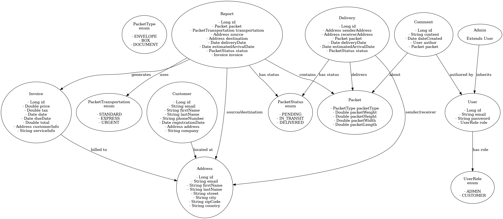

# spring-parcel-tracker-in-memory

This is a simple Spring Boot application that simulates a parcel tracking system. The application is in-memory and does not use any database. The application is built using Spring Boot, Spring Web, and Spring Data JPA.

## How to run the application

1. Clone the repository
2. Run the application using the following command:
```
mvn spring-boot:run
```
3. The application will start on port 8080. You can access the application using the following URL:
```
http://localhost:8080
```

## Architecture

The following diagrama show the architecture of the application:


